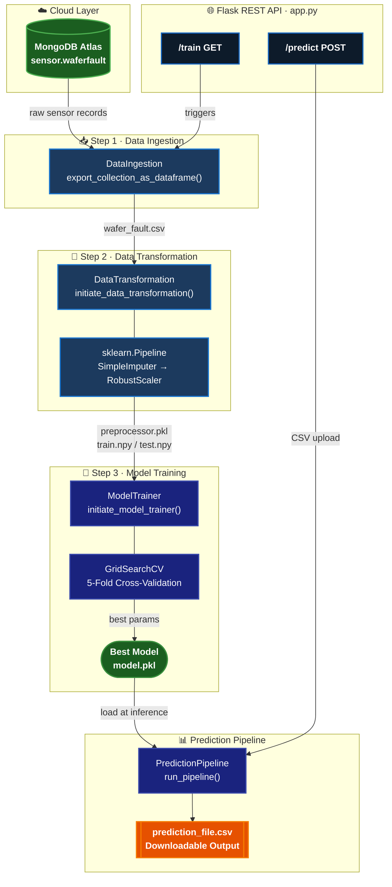
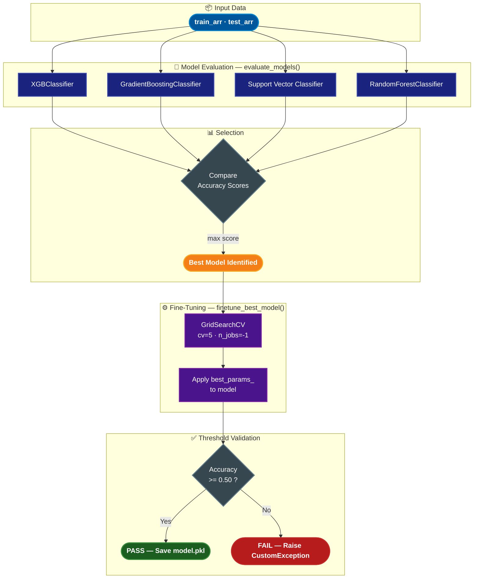

<h1 align="center">
  <br>
  🔬 Sensor Fault Detection
  <br>
</h1>

<h4 align="center">An end-to-end Machine Learning system to detect faulty wafer sensors using MongoDB, Flask, and automated ML pipelines.</h4>

<p align="center">
  <a href="#overview">Overview</a> •
  <a href="#tech-stack">Tech Stack</a> •
  <a href="#project-architecture">Architecture</a> •
  <a href="#project-structure">Project Structure</a> •
  <a href="#ml-pipeline">ML Pipeline</a> •
  <a href="#installation">Installation</a> •
  <a href="#usage">Usage</a> •
  <a href="#api-endpoints">API Endpoints</a> •
  <a href="#author">Author</a>
</p>

<p align="center">
  
  
  
  
  
  
</p>

---

## 📌 Overview

The **Sensor Fault Detection** system is a production-grade machine learning application designed to identify defective wafer sensors in semiconductor manufacturing. Each wafer sensor outputs a series of readings — the model classifies each sensor as **Good** or **Bad** based on those patterns.

The project demonstrates a complete MLOps workflow including:
- Cloud data storage via **MongoDB Atlas**
- Modular, reusable ML **pipeline components**
- Automated model selection with **GridSearchCV hyperparameter tuning**
- A **Flask REST API** for triggering training and serving batch predictions
- Structured **logging**, **custom exception handling**, and **artifact management**

---

## 🛠️ Tech Stack

| Category          | Technology                                      |
|-------------------|-------------------------------------------------|
| **Language**      | Python 3.8+                                     |
| **Web Framework** | Flask, Werkzeug                                 |
| **Database**      | MongoDB Atlas (via PyMongo)                     |
| **ML Libraries**  | Scikit-learn, XGBoost, Imbalanced-learn         |
| **Data**          | Pandas, NumPy, SciPy                            |
| **Visualization** | Matplotlib, Seaborn                             |
| **Config**        | PyYAML                                          |
| **Serialization** | Pickle                                          |
| **Packaging**     | Setuptools                                      |
| **Logging**       | Python `logging` module (rotating timestamped)  |

---

## 🏗️ Project Architecture

### 🗺️ High-Level System Overview



---

### 🔁 Training Pipeline — Sequence Diagram

```mermaid
sequenceDiagram
    autonumber
    actor       User
    participant Flask  as Flask API
    participant TP     as TrainingPipeline
    participant DI     as DataIngestion
    participant DB     as MongoDB Atlas
    participant DT     as DataTransformation
    participant MT     as ModelTrainer
    participant FS     as artifacts/

    rect rgb(13, 27, 42)
        Note over User, Flask: ── Training Request ──
        User  ->>+  Flask : GET /train
        Flask ->>+  TP    : run_pipeline()
    end

    rect rgb(27, 94, 32)
        Note over TP, FS: ── Stage 1 · Data Ingestion ──
        TP    ->>+  DI    : start_data_ingestion()
        DI    ->>+  DB    : MongoClient.find() — waferfault collection
        DB    -->>- DI    : Raw sensor DataFrame (590 cols)
        DI    -->>  FS    : wafer_fault.csv → artifacts/
        DI    -->>- TP    : feature_store_file_path
    end

    rect rgb(21, 47, 78)
        Note over TP, FS: ── Stage 2 · Data Transformation ──
        TP    ->>+  DT    : start_data_transformation(path)
        DT    -->>  DT    : SimpleImputer  fill_value=0
        DT    -->>  DT    : RobustScaler   fit on X_train
        DT    -->>  DT    : train_test_split 80 / 20
        DT    -->>  FS    : preprocessor.pkl · train.npy · test.npy
        DT    -->>- TP    : train_arr, test_arr, preprocessor_path
    end

    rect rgb(74, 20, 140)
        Note over TP, FS: ── Stage 3 · Model Training ──
        TP    ->>+  MT    : start_model_training(train_arr, test_arr)
        MT    -->>  MT    : Evaluate XGBClassifier
        MT    -->>  MT    : Evaluate GradientBoostingClassifier
        MT    -->>  MT    : Evaluate SVC
        MT    -->>  MT    : Evaluate RandomForestClassifier
        MT    -->>  MT    : Select best model by accuracy
        MT    -->>  MT    : GridSearchCV 5-fold fine-tune
        MT    -->>  FS    : model.pkl → artifacts/
        MT    -->>- TP    : trained_model_path
    end

    rect rgb(13, 27, 42)
        Note over TP, User: ── Response ──
        TP    -->>- Flask : Training Completed
        Flask -->>- User  : 200 OK — Training Completed
    end
```



---

### 🔮 Prediction Pipeline — Request Flow

```mermaid
flowchart LR
    classDef input     fill:#0D47A1,stroke:#1565C0,stroke-width:2px,color:#fff,font-weight:bold
    classDef process   fill:#1A237E,stroke:#283593,stroke-width:2px,color:#fff
    classDef model     fill:#4A148C,stroke:#6A1B9A,stroke-width:2px,color:#fff
    classDef good      fill:#1B5E20,stroke:#2E7D32,stroke-width:2px,color:#fff,font-weight:bold
    classDef bad       fill:#B71C1C,stroke:#C62828,stroke-width:2px,color:#fff,font-weight:bold
    classDef output    fill:#E65100,stroke:#BF360C,stroke-width:2px,color:#fff,font-weight:bold
    classDef decision  fill:#263238,stroke:#546E7A,stroke-width:2px,color:#fff

    subgraph INPUT [" 📨  Incoming Request "]
        A(["POST /predict\nCSV file upload"])
    end

    subgraph PREP [" 🗃️  File Handling "]
        B["save_input_files()\nprediction_artifact/input.csv"]
    end

    subgraph PREPROCESS [" ⚙️  Preprocessing "]
        C["get_predicted_dataframe()\nread CSV into DataFrame"]
        D["preprocessor.pkl\nRobustScaler · transform"]
    end

    subgraph INFERENCE [" 🧠  Model Inference "]
        E["model.pkl\nclassifier.predict"]
        F{"Label\nMapping"}
    end

    subgraph RESULT [" 📤  Output "]
        G(["Label: good\nSensor OK"])
        H(["Label: bad\nSensor Faulty"])
        I[["prediction_file.csv\nattachment download"]]
    end

    A --> B --> C --> D --> E --> F
    F -->|" 1 "| G --> I
    F -->|" 0 "| H --> I

    class A input
    class B,C process
    class D,E model
    class F decision
    class G good
    class H bad
    class I output
```



---

## 📁 Project Structure

```
sensor fault detection/
│
├── app.py                          # Flask application entry point
├── upload_data.py                  # Script to seed MongoDB with wafer CSV data
├── setup.py                        # Package setup configuration
├── requirements.txt                # All Python dependencies
│
├── config/
│   └── model.yaml                  # Hyperparameter search grids for all models
│
├── src/
│   ├── __init__.py
│   ├── exception.py                # Custom exception class with traceback details
│   ├── logger.py                   # Timestamped rotating file logger
│   │
│   ├── constant/
│   │   └── __init__.py             # Global constants (DB name, collection, paths)
│   │
│   ├── utils/
│   │   └── main_utils.py           # Utility: YAML reader, pickle save/load
│   │
│   ├── components/
│   │   ├── data_ingestion.py       # MongoDB → CSV export to artifacts/
│   │   ├── data_transformation.py  # Imputation + Scaling pipeline builder
│   │   └── model_trainer.py        # Train, evaluate, fine-tune, save best model
│   │
│   └── pipeline/
│       ├── train_pipeline.py       # Orchestrates full training workflow
│       └── predict_pipeline.py     # Handles file upload + batch prediction
│
├── notebooks/
│   ├── EDA.ipynb                   # Exploratory Data Analysis notebook
│   └── wafer_23012020_041211.csv   # Raw wafer sensor dataset
│
├── templates/
│   └── upload_file.html            # HTML UI for CSV file upload
│
├── workflow/                       # Architecture & code flow diagrams (PNG)
│   ├── Sensor Fault Detection High Level Flow.png
│   ├── Training Pipeline code flow.png
│   ├── data ingestion code flow.png
│   ├── data Transformation code flow.png
│   ├── Model Trainer code flow.png
│   └── prediction pipeline code flow.png
│
├── artifacts/                      # Auto-generated: model.pkl, preprocessor.pkl, CSVs
├── logs/                           # Auto-generated: timestamped log files
└── predictions/                    # Auto-generated: output prediction CSVs
```

---

## 🤖 ML Pipeline

### 1️⃣ Data Ingestion
- Connects to **MongoDB Atlas** and fetches all documents from the `waferfault` collection in the `sensor` database
- Cleans `_id` column and replaces `"na"` strings with `NaN`
- Exports raw data to `artifacts/wafer_fault.csv`

### 2️⃣ Data Transformation
- Reads the feature store CSV and renames the target column
- Encodes target: `-1 → 0` (Bad), `1 → 1` (Good)
- Splits data: **80% train / 20% test**
- Builds a `sklearn.Pipeline` with:
  - `SimpleImputer(strategy='constant', fill_value=0)` — handles missing sensor readings
  - `RobustScaler()` — scales features robustly to outliers
- Saves the fitted **preprocessor** as `artifacts/preprocessor.pkl`
- Outputs `train.npy` and `test.npy`

### 3️⃣ Model Training & Selection

Four classifiers are evaluated automatically:

| Model                        | Hyperparameter Tuning via GridSearchCV |
|------------------------------|----------------------------------------|
| `XGBClassifier`              | learning_rate, max_depth, n_estimators, gamma |
| `GradientBoostingClassifier` | n_estimators, criterion                |
| `SVC`                        | C, kernel, gamma                       |
| `RandomForestClassifier`     | n_estimators, max_depth, min_samples_split, min_samples_leaf |



- All models are trained and scored on **accuracy**
- The **best model** is fine-tuned with 5-fold cross-validated GridSearchCV
- If no model achieves ≥ 50% accuracy, training is aborted with an exception
- Final model is serialized to `artifacts/model.pkl`

---

## ⚙️ Installation

### Prerequisites
- Python 3.8+
- MongoDB Atlas account (or local MongoDB instance)

### 1. Clone the repository

```bash
git clone https://github.com/tushar80rt/sensor_fault.git
cd "sensor fault detection"
```

### 2. Create and activate a virtual environment

```bash
# Windows
python -m venv venv
venv\Scripts\activate

# Linux / macOS
python -m venv venv
source venv/bin/activate
```

### 3. Install dependencies

```bash
pip install -r requirements.txt
```

### 4. Configure your credentials

All constants are defined in `src/constant/__init__.py`. Update this file with your own MongoDB connection string:

```python
# src/constant/__init__.py

AWS_S3_BUCKET_NAME    = "your-s3-bucket-name"
MONGO_DATABASE_NAME   = "sensor"
MONGO_COLLECTION_NAME = "waferfault"
MONGO_DB_URL          = "mongodb+srv://<username>:<password>@<cluster>.mongodb.net/"
TARGET_COLUMNS        = "quality"
MODEL_FILE_NAME       = "model"
MODEL_FILE_EXTENSION  = ".pkl"
artifact_folder       = "artifacts"
```

> ⚠️ **Security Warning:** Credentials are currently hardcoded. Before pushing to GitHub, consider moving `MONGO_DB_URL` to an environment variable using `os.getenv("MONGO_DB_URL")` to avoid exposing sensitive data.

### 5. Seed the database (first-time setup)

```bash
python upload_data.py
```

This uploads the wafer sensor CSV from `notebooks/` to your MongoDB `sensor.waferfault` collection.

---

## 🚀 Usage

### Start the Flask Application

```bash
python app.py
```

The server starts on `http://0.0.0.0:5000`

---

## 🌐 API Endpoints

| Method | Endpoint   | Description                                                                 |
|--------|------------|-----------------------------------------------------------------------------|
| `GET`  | `/`        | Health check — returns welcome message                                       |
| `GET`  | `/train`   | Triggers the full training pipeline (ingestion → transformation → training) |
| `GET`  | `/predict` | Renders the CSV upload form (HTML UI)                                        |
| `POST` | `/predict` | Accepts a CSV file upload; returns downloadable prediction CSV               |

### Example: Trigger Training

```bash
curl http://localhost:5000/train
```

### Example: Batch Prediction via curl

```bash
curl -X POST -F "file=@your_sensor_data.csv" http://localhost:5000/predict --output predictions.csv
```

The returned CSV will contain an additional `quality` column with values:
- `"good"` → Sensor is functioning correctly
- `"bad"` → Sensor is faulty

---

## 📊 Exploratory Data Analysis

The `notebooks/EDA.ipynb` notebook covers:
- Dataset shape, column distributions, and missing value analysis
- Class imbalance exploration (`Good` vs `Bad` sensors)
- Feature correlation heatmaps
- Outlier detection

To run it:
```bash
jupyter notebook notebooks/EDA.ipynb
```

---

## 📂 Artifacts Generated

After running the training pipeline, the following artifacts are created automatically:

| File                          | Description                        |
|-------------------------------|------------------------------------|
| `artifacts/wafer_fault.csv`   | Raw data exported from MongoDB     |
| `artifacts/preprocessor.pkl`  | Fitted imputer + scaler pipeline   |
| `artifacts/model.pkl`         | Best trained & fine-tuned model    |
| `predictions/prediction_file.csv` | Batch prediction output       |
| `logs/<timestamp>.log`        | Timestamped execution logs         |

---

## 🔧 Configuration

Model hyperparameter grids are fully configurable via `config/model.yaml`:

```yaml
model_selection:
  model:
    XGBClassifier:
      search_param_grid:
        learning_rate: [0.1, 0.01, 0.001]
        max_depth: [3, 5, 7]
        n_estimators: [100, 200, 300]
        gamma: [0, 0.1, 0.2]
    RandomForestClassifier:
      search_param_grid:
        n_estimators: [100, 200, 300]
        max_depth: [null, 5, 10]
        ...
```

---

## 🗂️ Workflow Diagrams

Visual code-flow diagrams are provided in the `workflow/` directory:

| Diagram | Description |
|---------|-------------|
| `Sensor Fault Detection High Level Flow.png` | End-to-end system overview |
| `Training Pipeline code flow.png` | Training pipeline class interactions |
| `data ingestion code flow.png` | MongoDB → feature store flow |
| `data Transformation code flow.png` | Preprocessing steps breakdown |
| `Model Trainer code flow.png` | Model selection & tuning logic |
| `prediction pipeline code flow.png` | Batch prediction request handling |

---

## 👤 Author

**Tushar Singh**

- 📧 Email: [tushar80rt@gmail.com](mailto:tushar80rt@gmail.com)
- 🐙 GitHub: [@tushar80rt](https://github.com/tushar80rt)

---

## 📄 License

This project is licensed under the **MIT License** — feel free to use, modify, and distribute.

---

<p align="center">
  Made with ❤️ by Tushar Singh | Sensor Fault Detection © 2024
</p>
